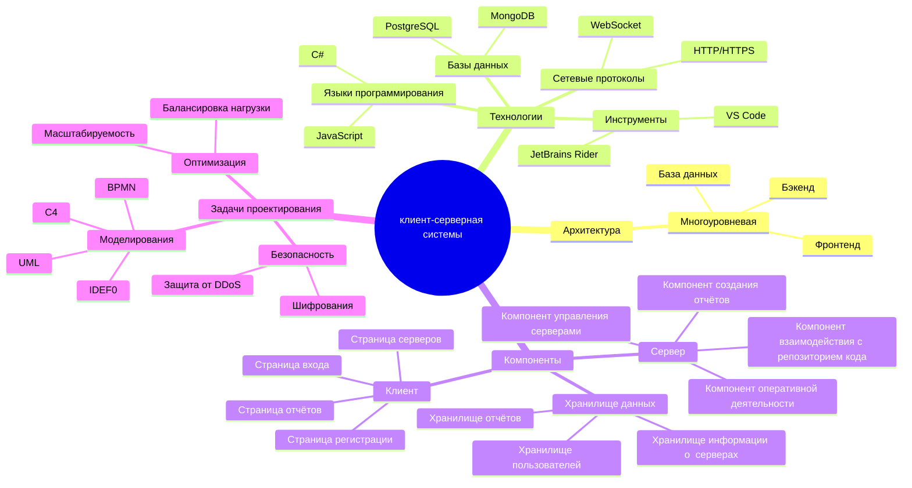
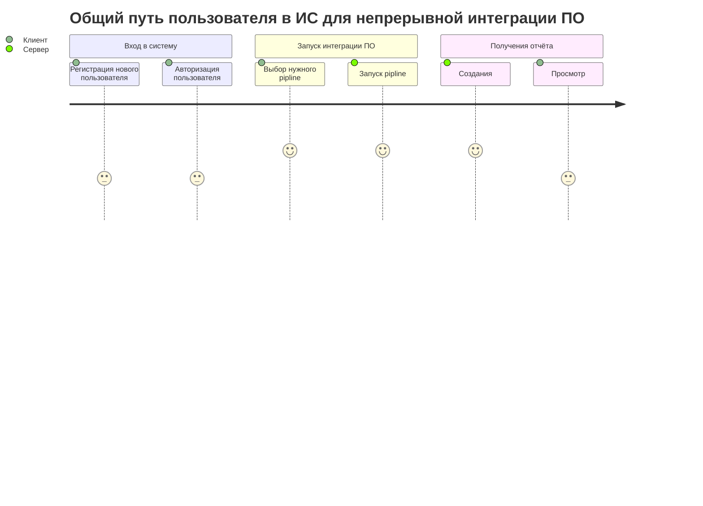
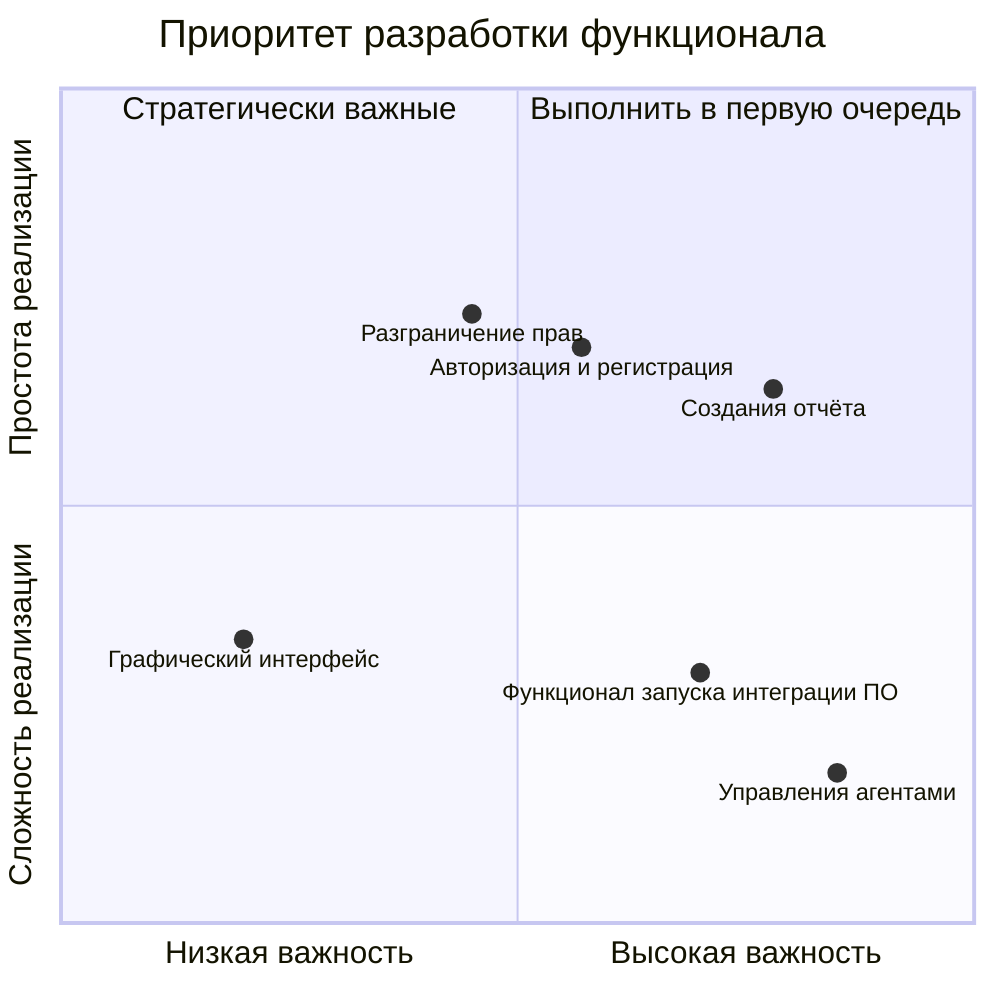
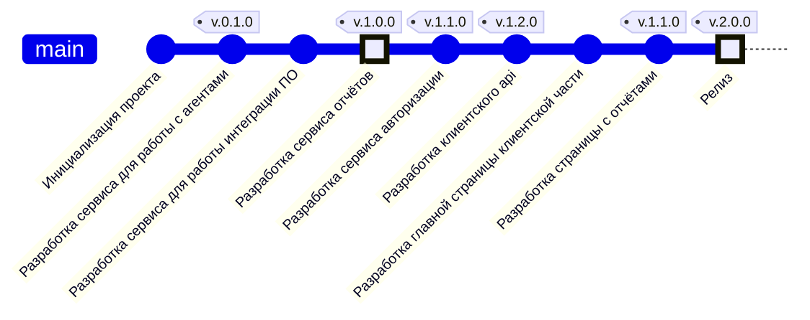

## Mind Map

```mermaid
mindmap
  root((клиент-серверная системы))
    Архитектура
      Многоуровневая 
        Фронтенд
        Бэкенд
        База данных
    Технологии
      Инструменты
        JetBrains Rider
        VS Code
      Сетевые протоколы
        HTTP/HTTPS
        WebSocket
      Языки программирования
        C#
        JavaScript
      Базы данных
        PostgreSQL
        MongoDB
    Компоненты
      Сервер
        Компонент взаимодействия с репозиторием кода
        Компонент создания отчётов
        Компонент оперативной деятельности
        Компонент управления серверами
      Клиент
        Страница регистрации
        Страница входа
        Страница отчётов
        Страница серверов
      Хранилище данных
        Хранилище отчётов
        Хранилище пользователей
        Хранилище информации о  серверах
    Задачи проектирования
      Оптимизация
        Балансировка нагрузки
        Масштабируемость
      Безопасность
        Шифрования
        Защита от DDoS
      Моделирования
        С4
        UML
        BPMN
        IDEF0
```

### User Journey Diagram

```mermaid
journey
    title Общий путь пользователя в ИС для непрерывной интеграции ПО
    section Вход в систему
      Регистрация нового пользователя: 3: Клиент
      Авторизация пользователя: 3: Клиент
    section Запуск интеграции ПО
      Выбор нужного pipline: 5: Клиент
      Запуск pipline: 5: Сервер
    section Получения отчёта
      Создания: 5: Сервер
      Просмотр: 3: Клиент

```

## Quadrant Chart

```mermaid
quadrantChart
    title Приоритет разработки функционала
    x-axis "Низкая важность" --> "Высокая важность"
    y-axis "Сложность реализации" --> "Простота реализации"
    quadrant-1 "Выполнить в первую очередь"
    quadrant-2 "Стратегически важные"
    "Функционал запуска интеграции ПО": [0.7, 0.3]
    "Разграничение прав": [0.45, 0.73]
    "Авторизация и регистрация": [0.57, 0.69]
    "Создания отчёта": [0.78, 0.64]
    "Графический интерфейс": [0.20, 0.34]
    "Управления агентами": [0.85, 0.18]
```

## Gitgraph 

``` mermaid
gitGraph
   commit id: "Инициализация проекта"
   commit id: "Разработка сервиса для работы с агентами" tag: "v.0.1.0"
   commit id: "Разработка сервиса для работы интеграции ПО"
   commit id: "Разработка сервиса отчётов" type: HIGHLIGHT tag: "v.1.0.0"
   commit id: "Разработка сервиса авторизации" tag: "v.1.1.0"
   commit id: "Разработка клиентского api" tag: "v.1.2.0"
   commit id: "Разработка главной страницы клиентской части"
   commit id: "Разработка страницы с отчётами" tag: "v.1.1.0"
   commit id: "Релиз" type: HIGHLIGHT tag: "v.2.0.0"

```