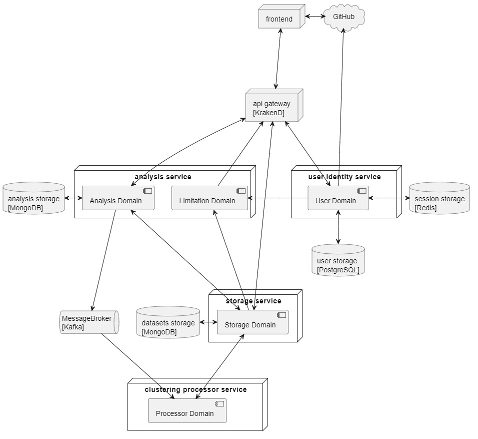

# Приложение для обработки больших данных
Приложение реализует функционал кластеризация больших данных. 

Приложение состоит из нескольких микросервисов:
- UserService - сервис отвечает за информацию о пользователях и их сессий.
- AnalysisService - сервис содержит информацию о всех запросах пользователя, на обработку данных 
- StorageService - хранит датасеты пользователя
- ClusteringService - сервис, выполняющий кластеризацию

## Архитектура
